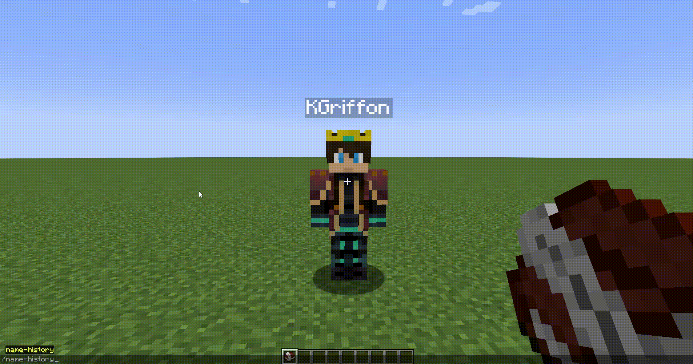

# Player Search

---

Player Search is a client-side mod that allows you to search for a player and find :
- his skin (not downloadable yet)
- his uuid
- his name history

## Commands

This mod adds two commands :

### `/search`

This command opens the search interface.  
You can also use `/search <player>` to open the interface and search directly for a player present on the same server as you.

Mod Menu Integration

You can also open this interface from the mod list.

### `/name-history <player>`

This command lets you search the name history of a player on the same server as you.

---

### Credits

Thanks to [enjarai](https://github.com/enjarai) for the code to display a player (from [Show Me Your Skin!](https://github.com/enjarai/show-me-your-skin)).